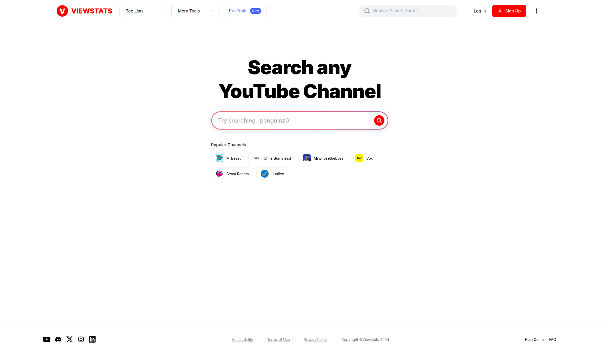

# **Recreate MrBeast's ViewStats Website with HTML & CSS**



## **Project Description**
This project is a recreation of the homepage design for **MrBeast's ViewStats** website using only **HTML** and **CSS**. The purpose of this project is to teach the fundamentals of web design and layout creation through a practical example.

The recreated website includes:
- A responsive navigation bar with links and buttons.
- A centered hero section with a search input.
- A grid layout showcasing popular channels.
- A minimalistic footer for additional links and credits.

This project is perfect for **beginner web developers** and those looking to enhance their CSS layout skills.

---

## **Features**
- Fully responsive design.
- Elegant and clean user interface.
- Styled components like buttons, inputs, and grids.
- Focus on semantic HTML structure and reusable CSS classes.

---

## **Getting Started**
Follow these instructions to get a copy of the project running on your local machine for development or learning purposes.

### **Prerequisites**
- A text editor like **VS Code**, **Sublime Text**, or **Atom**.
- A browser (Google Chrome, Mozilla Firefox, or any modern browser).
- Basic knowledge of HTML and CSS.

---

### **Installation**
1. Clone the repository:
   ```bash
   git clone https://github.com/bonaventureogeto/MrBeast-s-ViewStats-Clone.git
   ```
2. Navigate to the project directory:
   ```bash
   cd viewstats-clone
   ```
3. Open the `index.html` file in your browser:
   ```bash
   open index.html
   ```

---

## **File Structure**
```
viewstats-clone/

├── index.html                    # Main HTML file
├── style.css                     # CSS file for styling
├── README.md                     # Project documentation
```

---

## **Preview**
Here's what the recreated website looks like:


---

## **Demo**
You can preview the live version of the recreated website here:  
👉 [Live Demo](https://bonaventureogeto.github.io/MrBeast-s-ViewStats-Clone)

---

## **Lessons Learned**
This project teaches you:
- **HTML structure:** Building semantic and accessible layouts.
- **CSS styling:** Using modern techniques for responsiveness and design.
- **Flexbox & Grid:** Creating layouts that adapt across devices.

---

## **Contributing**
Contributions are welcome! If you find a bug or want to enhance the project:
1. Fork the repository.
2. Create a new branch: `git checkout -b feature-name`.
3. Commit your changes: `git commit -m 'Add feature'`.
4. Push to the branch: `git push origin feature-name`.
5. Open a pull request.

---

## **License**
This project is open-source and available under the [MIT License](LICENSE).

---

## **Author**
Created with ❤️ by [Bonaventure Ogeto](https://github.com/bonaventureogeto).